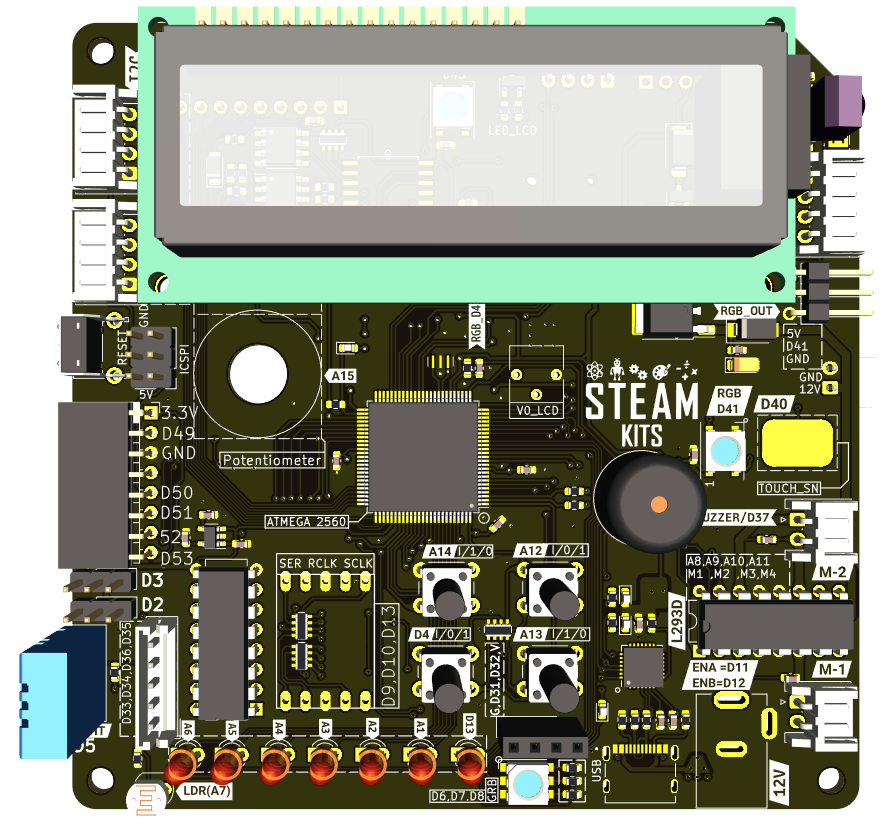
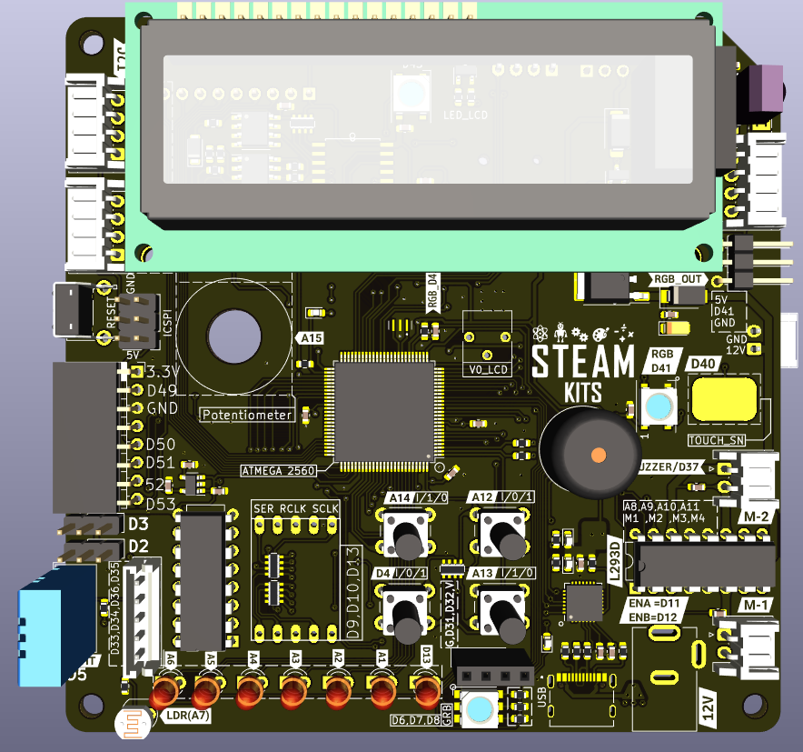
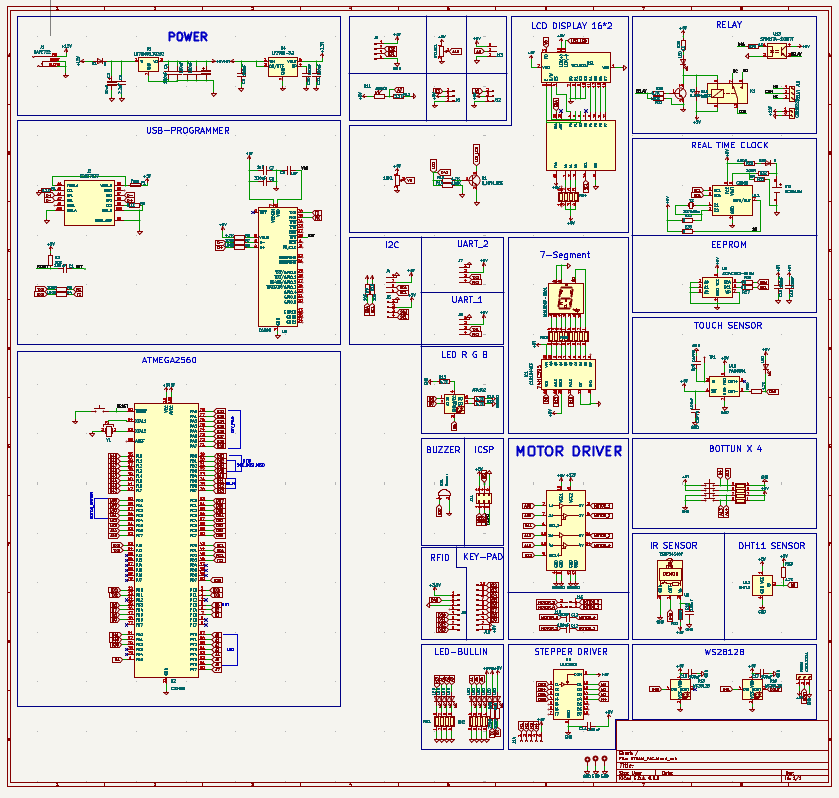
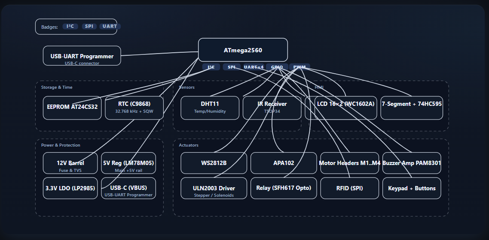
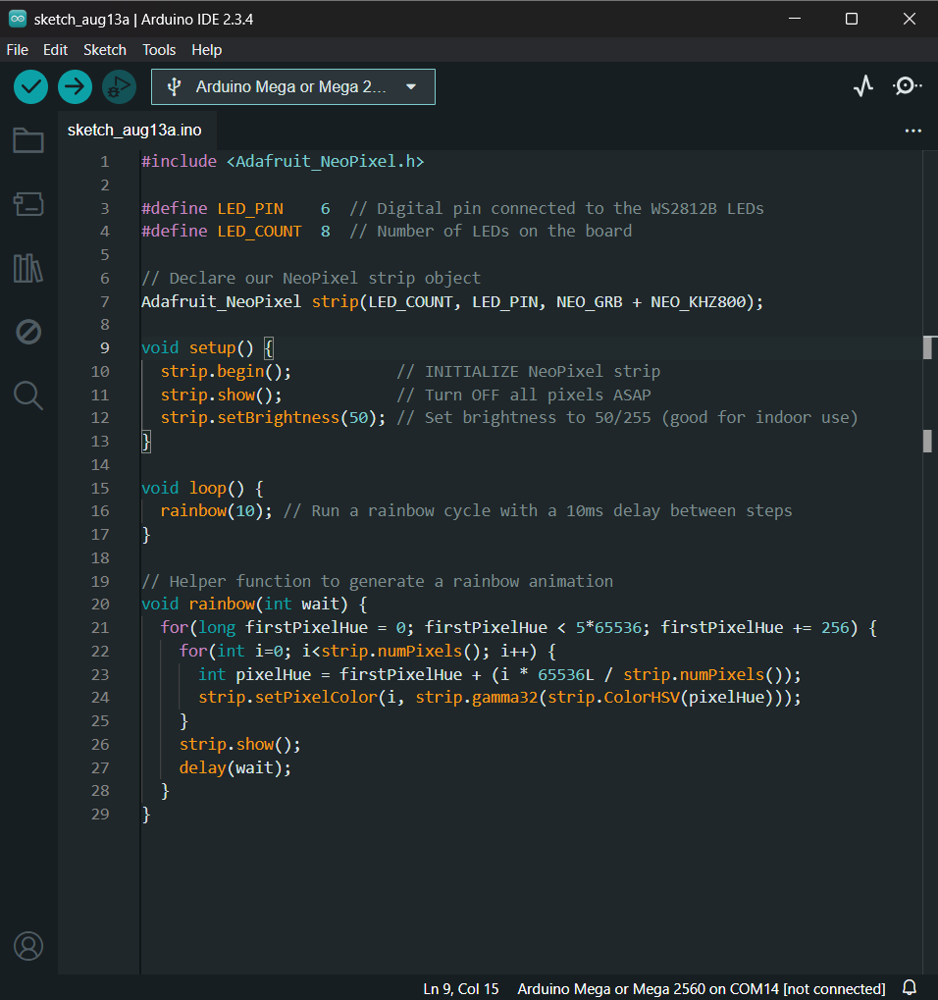

<!-- ============================== -->
<!-- ATmega2560 STEAM Development Board -->
<!-- ============================== -->
<h1 align="center">🧪 ATmega2560 STEAM Development Board</h1>
<p align="center">
<!-- NOTE: Replace this placeholder with an actual image of your board -->

</p>
<p align="center">
<a href="https://opensource.org/licenses/MIT"></a>


</p>
<p align="justify">
An all-in-one, feature-rich platform designed to accelerate learning and prototyping for students, educators, and makers. This board integrates a powerful ATmega2560 microcontroller with a curated set of sensors, actuators, and displays, allowing you to go from <strong>idea to a working prototype in minutes</strong> without the hassle of complex wiring.
</p>
<hr>
<!-- ============================== -->
<!-- 🌐 Overview -->
<!-- ============================== -->
<h2>🌐 Overview</h2>
<p align="justify">
The <strong>ATmega2560 STEAM Development Board</strong> eliminates the initial barrier of breadboarding and wiring common in electronics projects. By integrating essential components directly onto a single PCB, users can focus on what truly matters: <strong>programming, problem-solving, and creativity</strong>. It provides:
<ul>
<li>A powerful Arduino Mega-compatible core</li>
<li>A full suite of on-board sensors for environmental interaction</li>
<li>A variety of displays and actuators for immediate feedback</li>
<li>A robust and expandable design for custom projects</li>
</ul>
Ideal for <strong>classroom labs, maker projects, interactive art</strong>, and <strong>rapid prototyping</strong>, this board is engineered for versatility, ease of use, and educational impact.
</p>
<hr>
<!-- ============================== -->
<!-- 🖼️ Project Visuals -->
<!-- ============================== -->
<h2>🖼️ Project Visuals</h2>
<h3>🔧 Board and Schematic</h3>
<table>
<tr>
<th align="center">Top View of the Board</th>
<th align="center">Schematic Overview</th>
</tr>
<tr>
<!-- NOTE: Replace these placeholders with your actual images -->
<td></td>
<td></td>
</tr>
</table>
<hr>
<!-- ============================== -->
<!-- 🧠 System Architecture -->
<!-- ============================== -->
<h2>🧠 System Architecture</h2>
<p align="justify">
The system is built around the <strong>ATmega2560 microcontroller</strong>, which acts as the central brain. It interfaces with all on-board peripherals using standard communication protocols like I²C, SPI, UART, and digital/analog I/O. A modern USB-C port with a CP2102 bridge provides a seamless connection for programming and serial communication. The modular design ensures that all components work together harmoniously, managed by the user's Arduino code.
</p>
<p align="center">
<!-- NOTE: Replace this placeholder with an actual system diagram image -->
<a href="Docs/images/system_architecture_diagram.png" target="_blank">

</a>
</p>
<p align="center">
<em>Click the image to view it in full resolution.</em>
</p>
<ul>
<li><strong>Central Controller:</strong> ATmega2560 manages all peripherals.</li>
<li><strong>Power System:</strong> Accepts 12V barrel jack or USB-C power, providing regulated 5V and 3.3V.</li>
<li><strong>Communication:</strong> USB-C via CP2102 for programming and data transfer.</li>
<li><strong>Expandability:</strong> Breakout headers expose unused I/O for connecting external modules.</li>
</ul>
<hr>
<!-- ============================== -->
<!-- ⚙️ How It Works -->
<!-- ============================== -->
<h2>⚙️ How It Works</h2>
<ol>
<li><strong>Power Up:</strong> Connect the board via USB-C or a 12V DC barrel jack adapter.</li>
<li><strong>Program:</strong> Connect to a computer, select "Arduino Mega 2560" in the Arduino IDE, and upload your sketch.</li>
<li><strong>Sense:</strong> The microcontroller reads data from on-board sensors like the DHT11 (temp/humidity), LDR (light), and potentiometer.</li>
<li><strong>Actuate:</strong> Your code processes the sensor data and controls outputs like the LCD, RGB LEDs, motors, and buzzer.</li>
<li><strong>Interact:</strong> Use the on-board RFID reader and push-buttons for direct user input.</li>
</ol>
<hr>
<!-- ============================== -->
<!-- 🛠️ Technical Specifications -->
<!-- ============================== -->
<h2>🛠️ Technical Specifications</h2>
<h3>🔩 Hardware Components & Pinout</h3>
<table>
<tr>
<th>Component</th>
<th>Description</th>
<th>Interface / Pin</th>
</tr>
<!-- MCU & Comms -->
<tr>
<td><strong>ATmega2560</strong></td>
<td>8-bit AVR Microcontroller</td>
<td>Core Processor</td>
</tr>
<tr>
<td><strong>CP2102</strong></td>
<td>USB-to-UART Bridge</td>
<td>UART0 (Pins 0, 1) via USB-C</td>
</tr>
<!-- Sensors -->
<tr>
<td><strong>DHT11</strong></td>
<td>Temperature & Humidity Sensor</td>
<td>Digital (Pin A0)</td>
</tr>
<tr>
<td><strong>LDR (Photoresistor)</strong></td>
<td>Light-Dependent Resistor</td>
<td>Analog (Pin A1)</td>
</tr>
<tr>
<td><strong>10kΩ Potentiometer</strong></td>
<td>Variable Resistor</td>
<td>Analog (Pin A2)</td>
</tr>
<!-- Actuators & Displays -->
<tr>
<td><strong>16x2 I²C LCD</strong></td>
<td>Liquid Crystal Display</td>
<td>I²C (SDA, SCL)</td>
</tr>
<tr>
<td><strong>WS2812B LEDs (x8)</strong></td>
<td>Addressable RGB LEDs</td>
<td>Digital (Pin 6)</td>
</tr>
<tr>
<td><strong>L293D Motor Driver</strong></td>
<td>Dual H-Bridge Motor Driver</td>
<td>Digital (Pins 3, 4, 5, 7)</td>
</tr>
<tr>
<td><strong>Piezo Buzzer</strong></td>
<td>Sound Actuator</td>
<td>Digital/PWM (Pin 8)</td>
</tr>
<!-- User I/O -->
<tr>
<td><strong>MFRC522 RFID Reader</strong></td>
<td>13.56MHz RFID Reader/Writer</td>
<td>SPI (Pins 50-53)</td>
</tr>
<tr>
<td><strong>Push Buttons (x2)</strong></td>
<td>Momentary Switches</td>
<td>Digital (Pins 2, 9)</td>
</tr>
</table>
<h3>💻 Software Stack</h3>
<ul>
<li><strong>Programming Language:</strong> C / C++</li>
<li><strong>IDE / Framework:</strong>
<ul>
<li><a href="https://www.arduino.cc/en/software">Arduino IDE</a> (v2.0 or later recommended)</li>
<li>PlatformIO with Arduino Framework</li>
</ul>
</li>
<li><strong>Key Libraries:</strong>
<ul>
<li><code>LiquidCrystal_I2C</code> (for LCD)</li>
<li><code>DHT sensor library</code> (for DHT11)</li>
<li><code>Adafruit NeoPixel</code> (for WS2812B)</li>
<li><code>MFRC522</code> (for RFID)</li>
</ul>
</li>
</ul>
<hr>
<!-- ============================== -->
<!-- 🚀 Getting Started -->
<!-- ============================== -->
<h2>🚀 Getting Started</h2>
<h3>🧰 Prerequisites</h3>
<ul>
<li>An ATmega2560 STEAM Development Board</li>
<li>A USB-C cable</li>
<li>A computer with the <a href="https://www.arduino.cc/en/software">Arduino IDE</a> installed</li>
<li>A 12V DC Power Supply (optional, but recommended for motor use)</li>
</ul>
<h3>🔌 First-Time Setup</h3>
<ol>
<li><strong>Connect Board:</strong> Plug the board into your computer using the USB-C cable.</li>
<li><strong>Configure IDE:</strong>
<ul>
<li>Open the Arduino IDE.</li>
<li>Go to <b>Tools > Board</b> and select <b>"Arduino Mega or Mega 2560"</b>.</li>
<li>Go to <b>Tools > Port</b> and select the correct COM port.</li>
</ul>
</li>
<li><strong>Install Libraries:</strong> Open the Library Manager (<b>Tools > Manage Libraries...</b>) and install the libraries listed in the Software Stack section above.</li>
<li><strong>Upload Code:</strong> Copy the example sketch below, paste it into the Arduino IDE, and click the "Upload" button.</li>
</ol>
<h3>🌈 Example Code: RGB LED Rainbow Cycle</h3>
<p>This sketch creates a beautiful rainbow animation on the 8 on-board RGB LEDs, confirming your setup is working correctly.</p>

<!-- 
  NOTE: 
  1. Create your code image using carbon.now.sh
  2. Upload the image to a folder in your repository (e.g., "Docs/images/code_example.png")
  3. Replace the link below with the link to YOUR image.
-->
<p align="center">
  
</p>

```cpp
#include <Adafruit_NeoPixel.h>

#define LED_PIN    6  // Digital pin connected to the WS2812B LEDs
#define LED_COUNT  8  // Number of LEDs on the board

// Declare our NeoPixel strip object
Adafruit_NeoPixel strip(LED_COUNT, LED_PIN, NEO_GRB + NEO_KHZ800);

void setup() {
  strip.begin();           // INITIALIZE NeoPixel strip
  strip.show();            // Turn OFF all pixels ASAP
  strip.setBrightness(50); // Set brightness to 50/255 (good for indoor use)
}

void loop() {
  rainbow(10); // Run a rainbow cycle with a 10ms delay between steps
}

// Helper function to generate a rainbow animation
void rainbow(int wait) {
  for(long firstPixelHue = 0; firstPixelHue < 5*65536; firstPixelHue += 256) {
    for(int i=0; i<strip.numPixels(); i++) {
      int pixelHue = firstPixelHue + (i * 65536L / strip.numPixels());
      strip.setPixelColor(i, strip.gamma32(strip.ColorHSV(pixelHue)));
    }
    strip.show();
    delay(wait);
  }
}
```
<hr>
<!-- ============================== -->
<!-- 📁 Repository Structure -->
<!-- ============================== -->
<h2>📁 Repository Structure</h2>
<pre>
📦 ATmega2560-STEAM-Board/
├── 📂 Docs/
│ ├── 📂 images/ # Project images and diagrams
│ └── 📂 datasheets/ # Datasheets for key components
├── 📂 Firmware/
│ ├── 📂 examples/ # Example Arduino sketches for all features
│ └── 📂 libraries/ # Custom or specific libraries (if any)
├── 📂 Hardware/
│ ├── STEAM_Board.kicad_pro # KiCAD project file
│ ├── STEAM_Board.kicad_sch # KiCAD schematic file
│ ├── STEAM_Board.kicad_pcb # KiCAD PCB layout file
│ └── Bill_of_Materials.csv # Component list for manufacturing
└── 📄 README.md # You are here!
</pre>
<p><em>Note: KiCAD files require <a href="https://www.kicad.org/">KiCAD v7.0 or later</a> to view and edit.</em></p>
<hr>
<!-- ============================== -->
<!-- 🤝 Contributing -->
<!-- ============================== -->
<h2>🤝 Contributing</h2>
<p>Contributions, issues, and feature requests are welcome! Please read our <code>CONTRIBUTING.md</code> file for guidelines on how to participate in this project. You can also open an issue or start a discussion on the repository's page.</p>
<hr>
<!-- ============================== -->
<!-- 📜 License -->
<!-- ============================== -->
<h2>📜 License</h2>
<p>This project is licensed under the <a href="https://opensource.org/licenses/MIT">MIT License</a>. See the <code>LICENSE</code> file for more details.</p>
